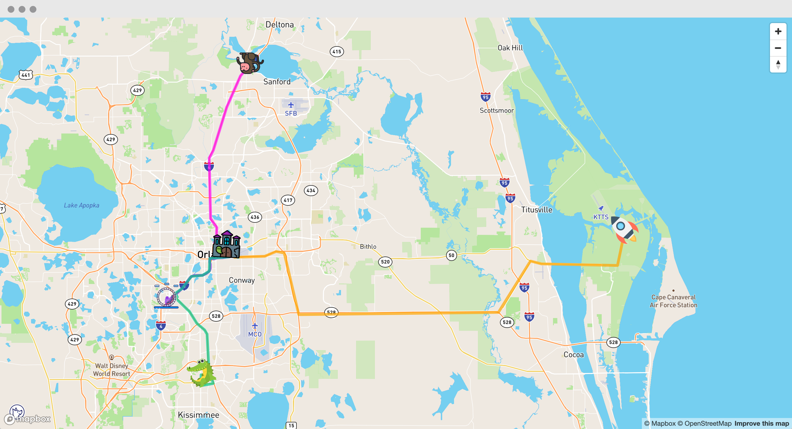

## Mapbox Example
Mapbox example demonstrating how to 
add multiple route paths to a map. It covers topics 
such as: 

- address geocoding
- adding markers
- directions API
- adding routes. 

## Resources

*Directions API*  
https://docs.mapbox.com/help/glossary/directions-api

*Map GL API*  
https://docs.mapbox.com/mapbox-gl-js/api

If you like this example or have questions, 
send me a tweet  
[@notmilosbejda](https://twitter.com/notmilobejda). Don't forget
to checkout my blog [mbejda.com](https://mbejda.com)
